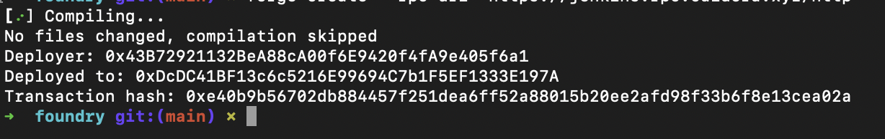

# Foundry
## What is Foundry?


Foundry is a Rust-based toolset for Ethereum development that helps developers manage dependencies, compile projects, run tests, deploy contracts, and interact with blockchains via the command line interface.

This tutorial will guide you through deploying and interacting with a smart contract on Apechain using Foundry.

### **Prerequisites**

- **Adding Apechain Testnet to MetaMask:**
    - You can find and add chain details [here](https://curtis.hub.caldera.xyz/) to your Metamask.
- **Obtaining Test ETH (Sepolia) and Bridging to Apechain Testnet:**
    - Visit [https://curtis.hub.caldera.xyz/](https://curtis.hub.caldera.xyz/)
    - Click on “Faucet”
    - Enter your wallet address
    - Click on ‘Request”
- **Required Installations:**
    - Node, NPM
    - Basic knowledge of React.js and Solidity

## Get Started with Foundry

Installing Foundry is simple, for MacOS and Linux, all we have to do is to run the following command

### **Linux or MacOS:**

```jsx
curl -L https://foundry.paradigm.xyz | bash foundryup
```

### Windows:

```jsx
curl --proto '=https' --tlsv1.2 -sSf https://sh.rustup.rs/ | sh

cargo install --git https://github.com/foundry-rs/foundry foundry-cli anvil --bins --locked
```

## **Create a Project**

Once we have Foundry installed, next thing we need to do is to initialize a new project.

```jsx
forge init foundry
```

Navigate to the Source Folder and Create a Smart Contract File:

```jsx
cd src

touch MyToken.sol
```

## **Write Your Smart Contract**

```jsx
// SPDX-License-Identifier: MIT
pragma solidity ^0.8.17;

contract HelloWorld {
    string public greeting = "Hello World!";

    function greet() public view returns (string memory) {
        return greeting;
    }
}
```

## **Compile Contract**

After writing our smart contract the next thing is to compile it and to do that we’re just going to copy and paste the command below into our terminal, please make sure you are in the project’s root directory.

```jsx
forge build
```

If that compiles with no error, that means our contract is correct and we’re ready to deploy to Apechain.

## **Smart Contract Deployment on Apechain**

When deploying smart contract to any chain, you need to pay deployment gas fee using the chain’s native token and it is no different for Apechain, before deploying to Apechain you need to make sure that you've acquired Apecoin testnet.

You can deploy on Apechain by using running forge create followed by the RPC URL, your wallet private key and src of your smart contract.

```jsx
forge create --rpc-url "https://curtis.rpc.caldera.xyz/http" --private-key `your-private-key` FileName.sol:ContractName
```

You should see a similar response like the one below



Congrats 🎉 🎊  you just deployed your smart contract to Apechain! Copy out the smart contract address “Deployed to” we’re going to be needing it on our React project.

## **Verify smart contract deployment**

Visit [Apechain’s explorer](https://curtis.explorer.caldera.xyz/), copy and paste your contract address into the search bar and you should be able to see your smart contract and every other

## Interacting with the Smart Contract

We’re done with creation and deployment of our smart contracts now it time to build a simple ReactJS 

```jsx
npx create-react-app my-dapp
```

## **Install ethers.js**

Ethers.js is a library that facilitates interaction between web applications and the blockchain.

On your terminal, navigate to the folder of the React Project you just created and run the command below.

```jsx
npm install ethers
```

## **Declare Contract Address and ABI**

The ABI (Application Binary Interface) is a crucial component in Ethereum smart contracts, serving as a method selector. It defines the specific functions and data structures that can be invoked on a smart contract, enabling interaction between the contract and external applications.

You can get your smart contract’s ABI once your contract builds successfully, to locate it, navigate to you out folder, you’ll see a folder with the same name as your solidity file, expand the folder and you’ll see a JSON file copy the JSON file and paste into the root folder of your ReactJS project.

## **Code the UI**

Now that we have our ABI file and we have etherjs installed, next it to build our UI but how you choose to build your UI is entirely up to you and the purpose of your app but for this guide, we’re just going to have a UI with a simple button and text to display the message returned by our smart contract.

```jsx
import React, { useEffect, useState } from "react";
import { ethers } from "ethers";
import ABI from "./HelloWorld.json";

function App() {
  const [provider, setProvider] = useState(null);
  const [message, setMessage] = useState(null);
  const contractAddress = "YOUR-DEPLOYED-SMART-CONTRACT-ADDRESS";

  useEffect(() => {
    if (typeof window !== "undefined") {
      if (window.ethereum) {
        const initializeProvider = async () => {
          if (window.ethereum) {
            await window.ethereum.request({ method: "eth_requestAccounts" });
            const provider = new ethers.providers.Web3Provider(window.ethereum);
            setProvider(provider);
          }
        };

        initializeProvider();
      } else {
        console.error("Please install MetaMask!");
      }
    }
  }, []);

  const greet = async () => {
    const contract = new ethers.Contract(contractAddress, ABI.abi, provider);
    const result = await contract.greet();
    setMessage(result);
    console.log(result);
  };
  return (
    <div>
      <h1>Apechain</h1>
      <button onClick={greet}>Interact with Contract</button>
      <h3>{message}</h3>
    </div>
  );
}

export default App;
```

In the above code we imported useEffect, useState, etherjs and our ABI JSON file, next we set our provider and message state and our contract address, after that, we initialized our provider inside of a useEffect so that it gets initialized as soon as the page loads, below that we have our greet function which creates a new instance of our deployed contract using the contractAddress, ABI and the provider we initialized earlier, after which we then hit the greet function we wrote in our smart contract and then set it to our message state so we can render it on the screen.

## **Run the Project**

```jsx
npm start
```

## **Conclusion**

This tutorial covered deploying and interacting with a smart contract on Apechain using Foundry. We installed Foundry, created a project, wrote and compiled a smart contract, and deployed it on Apechain. We then created a React app to interact with the contract using ethers.js.

