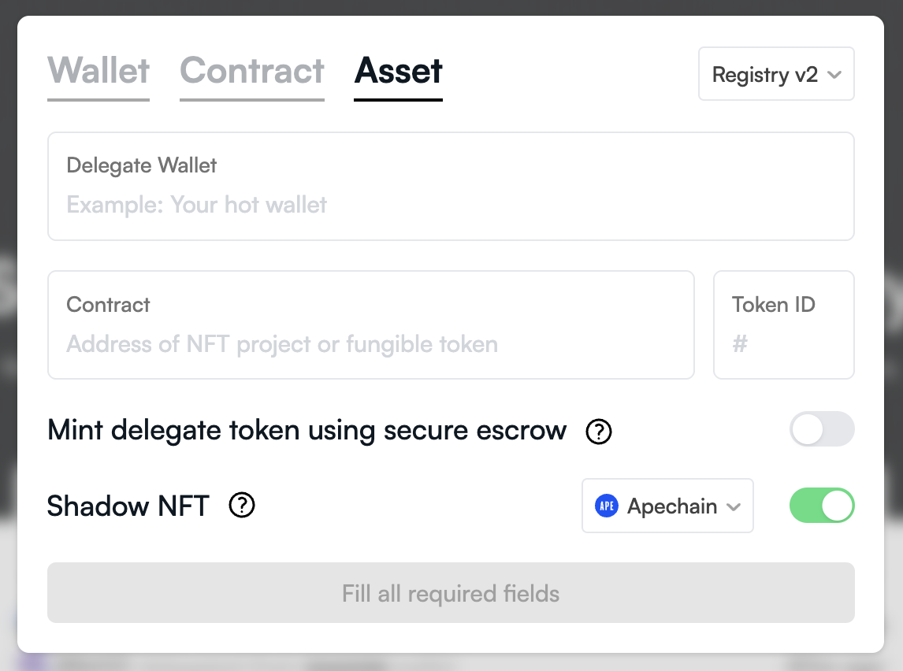

# NFT staking on ApeChain

- APE NFT staking is live on ApeChain starting April 15, 2025 at [apechainstake.io](https://apechainstake.io/). 
- Users must unstake their $APE tokens from apestake.io and restake it on the new staking portal [apechainstake.io](https://apechainstake.io/) to continue earning rewards. 
- This process involves unstaking from [apestake.io](https://apestake.io/), bridging $APE tokens from mainnet to ApeChain, and restaking the bridged $APE on the new staking website for BAYC, MAYC, and BAKC pools.
- When claiming rewards with the non-bridged (locked) shadows, there will be a 60 second delay to ensure the underlying asset's ownership has not changed.
- When claiming rewards with the bridged (unlocked) assets, there is no time delay and the process functions in the same way as on the existing [apestake.io](https://apestake.io/) portal.  

## Updates to staking:

- BAKC can be staked independently.
- $APE only staking has been removed. Instead, ApeChain offers [native yield](https://docs.apechain.com/apecoin-staking/native-yield/Overview) on $APE.
- The new staking website will not be geoblocked, including in the US.
- ⚠️ ***Your BAYC/MAYC/BAKC shadow will be your staking key on ApeChain*** ⚠️. Use delegation responsibly as the delegated wallet has rights to withdraw deposited $APE from the staking contract.
- Users can delegate their shadows on ApeChain to another wallet for staking their $APE. The shadow will be moved to the delegate wallet (detailed explanation below).
- There will be no changes to emissions from the new staking contract. 
- Native yield does not stack with staking yield. Users can hold $APE without staking to earn native yield (approx. 10-12%), or stake $APE to earn around 25-30% yield.
- Users can still claim rewards from the old site but won't earn any yield on it.
- Any unclaimed $APE will stay in the staking contract forever until it is claimed.

## NFT Shadows: bridging and delegation

- An [NFT Shadow](https://docs.apechain.com/start-building/NFT-Shadows) is an ERC721 token that mirrors ownership from their native chain.
- A Beacon contract coordinates cross-chain messaging and ownership verification, handles NFT locking/unlocking on native chains and maintains shadow-to-base collection mapping (as well as base-to-shadow for those that need it).
- Default state: even if a user has never interacted with a Shadow, the Shadow is already live on the same address as their underlying asset and in a locked state (meaning, it follows the mainnet asset). The default state of shadows in locked mode is soulbound, you cant move it on Apechain except for by moving or delegating it on mainnet.
- BAYC, MAYC, and BAKC shadow contracts have the same contract addresses as the underlying assets on mainnet, however  this will not be the case for all Shadow collections and should not be relied on as an invariant.
- Delegating your NFT is handled via [delegate.xyz](https://delegate.xyz/). For shadows to work via [delegate.xyz](https://delegate.xyz/) you need to click the "Shadows NFT" option to trigger your shadow NFT's movement as well as "all chains" or "Apechain".



- If you just perform a regular delegation on delegate.xyz, then this wouldn't have any effect on shadow ownership.
- If you do not issue a shadow delegation, your shadow (soulbound) will exist in the same wallet as the underlying asset.
- If you do issue a shadow delegation, the shadow will move to that delegated wallet.
- If you have multiple shadow delegations, asset ownership is determined by specificity first (token delegation overrides contract delegation overrides wallet delegation), and ties are broken by recency (newest wins).
- Upon bridging, your Shadow NFT becomes the de-facto proof of ownership. Whoever owns it, is able to retrieve the mainnet asset. The Shadow will also be responsible for depositing, withdrawing, and claiming from the new $APE staking contract.
- Locked state (default state): Transferable only by the Beacon contract, adhering to canonical ownership.
- Unlocked state (bridged asset): it means the underlying asset will be locked in the Beacon contract on mainnet and the Shadow behaves like a standard ERC721, i.e. can be transferred freely.
- The owner of the unlocked shadow (now simply bridged NFTs, since once they're unlocked they're no longer shadows) can pull it out of the mainnet Beacon.
- When claiming rewards on the updated ApeChain staking portal, there will be ~60 seconds delay to ensure the underlying asset's ownership has not changed. This is in contrast to the current mainnet staking portal where $APE claim is instant.

## Effect on third-party protocols:

- When claiming rewards with the non-bridged (locked) shadows, there will be ~60 seconds delay to ensure the underlying asset's ownership has not changed. The actual transfer of tokens will occur in a separate transaction (the LayerZero callback), so protocols should not implement things like “claim and withdraw” that issue a claim request and then transfer the NFT in the same transaction – the claim will not complete.
- Protocols can decide which ownership method to rely on. For instant/optimistic checks, they can just use ```ownerOf```.
- This will be sufficient in most cases, but if it's a high value claim that may lead to intentional misuse of the asynchronous ownership updates, then the verified ownership functions should be used, as documented [here](https://docs.apechain.com/start-building/NFT-Shadows#2-verified-ownership-with-callbacks). Failures and edge cases when verifying ownership are outlined [here](https://docs.apechain.com/start-building/NFT-Shadows#error-handling-and-edge-cases).
- ERC-20 approval for $APE tokens will not be required as $APE is the native token for ApeChain.

## Contracts:

| Contract | Network | Address |
| -------- | ------- | ------- |
| Ape Staking (old) | Ethereum | [0x5954aB967Bc958940b7EB73ee84797Dc8a2AFbb9](https://etherscan.io/address/0x5954aB967Bc958940b7EB73ee84797Dc8a2AFbb9) |
| ApeChain Staking (new) | ApeChain | [0x4Ba2396086d52cA68a37D9C0FA364286e9c7835a](https://apescan.io/address/0x4Ba2396086d52cA68a37D9C0FA364286e9c7835a) |
| ApeChain Testnet Staking | Curtis | [0x07593093738c62e34b921ceb8eb871cc840400f4](https://curtis.apescan.io/address/0x07593093738c62e34b921ceb8eb871cc840400f4) |
| Wrapped APE (WAPE) | ApeChain | [0x48b62137EdfA95a428D35C09E44256a739F6B557](https://apescan.io/token/0x48b62137EdfA95a428D35C09E44256a739F6B557) |
| BAYC Shadow | ApeChain | [0xbc4ca0eda7647a8ab7c2061c2e118a18a936f13d](https://apescan.io/token/0xbc4ca0eda7647a8ab7c2061c2e118a18a936f13d) |
| MAYC Shadow | ApeChain | [0x60e4d786628fea6478f785a6d7e704777c86a7c6](https://apescan.io/address/0x60e4d786628fea6478f785a6d7e704777c86a7c6) |
| BAKC Shadow | ApeChain | [0xba30e5f9bb24caa003e9f2f0497ad287fdf95623](https://apescan.io/address/0xba30e5f9bb24caa003e9f2f0497ad287fdf95623) |