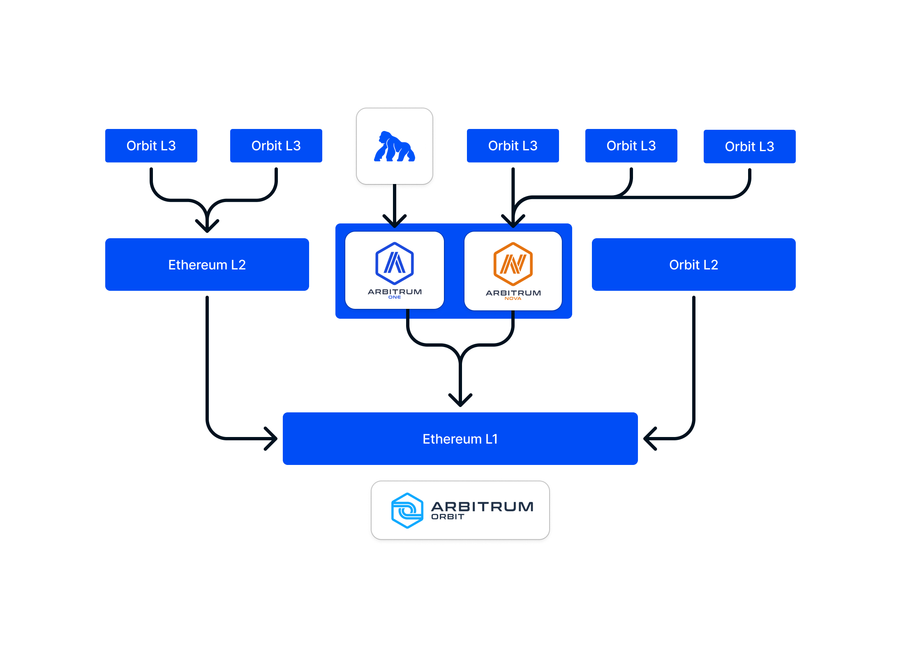

# ApeChain Architecture
## ApeChain at its core is an Arbitrum Orbit L3.

Orbit chains are deployable, configurable instances of the Arbitrum Nitro tech stack that can be tailored precisely to match a project's exact use-case and business needs.
Each Orbit chain is capable of supporting many times the capacity of Ethereum, all while benefitting directly from Ethereum's security.

  

Orbit Chains can be a Layer 2 (L2) chain which settles directly to Ethereum, or a Layer 3 (L3) chain - like **ApeChain** - which can settle to any Ethereum L2, such as Arbitrum One.

Orbit L3 chains offer:
- **Full EVM equivalance**
- **Anytrust Data Availability for ultra-low-cost transactions**
- **Dedicated throughput and increased gas price reliability**

## Curtis Testnet
The Curtis Testnet is meant to provide a testing ground for developers and enthusiasts to explore the potential of ApeChain in preparation for Mainnet launch. 

Curtis currently boasts:
- 0.25s **minimum** blocktime
- $APE as a native token
- [Native Bridge](/bridge) to Arbitrum Sepolia
- Functional [Native Yield](/native-yield)
- Fast Withdrawals