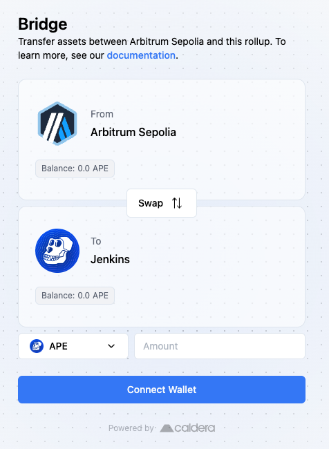
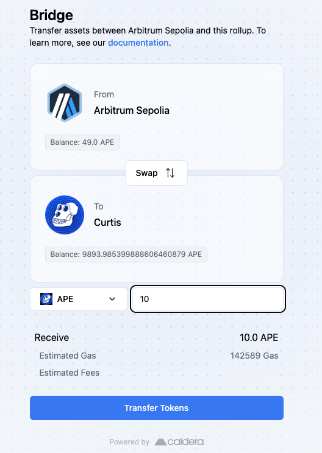
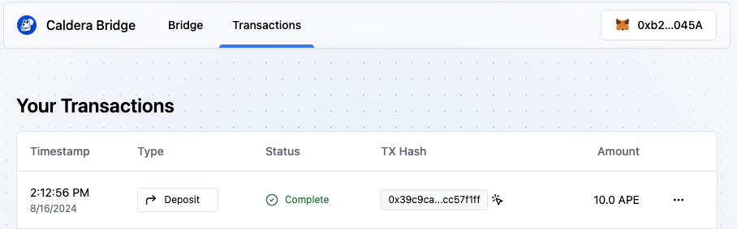
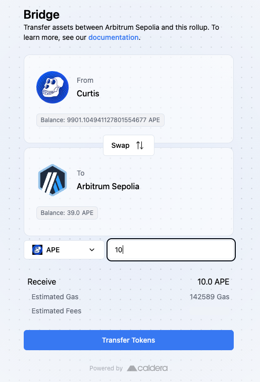
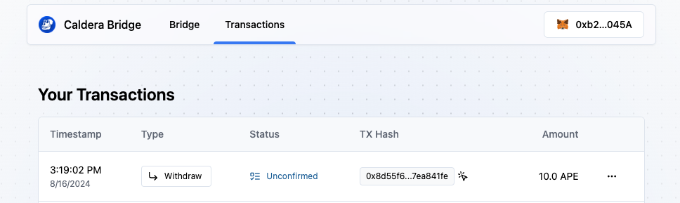
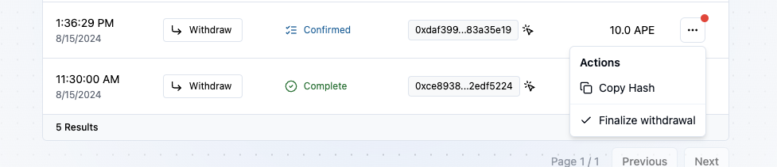

# Bridge Assets to ApeChain

To bridge assets to & from the ApeChain Network: 
1. Navigate to the ApeChain [Bridge Interface](https://curtis.bridge.caldera.xyz/)
2. Specify the direction you want the swap to take place
3. Connect your wallet (if necessary)
4. Enter the amount of token that you want to swap 

Afterwards, your funds should be on the way to the desired destination chain!

 

 ## Bridging from Arbitrum Sepolia to Curtis ##

 You will be promoted that you switch to the Arbitrum Speolia network 

| Tesnet      | Details|    
| :------------ | :---------: 
| Network Name | Arbitrum Sepolia |
| RPC URL        |    https://sepolia-rollup.arbitrum.io/rpc   |
| Chain ID    |    421614   |   
| Currency Symbol|         ETH    |
| Block Explorer URL | https://sepolia.arbiscan.io/

**Please note:**
You will need testnet initially for Arbitrum Sepolia 
If you have attended hackathons at [ETHGlobal](https://ethglobal.com) in the past, be sure to view their [faucet](https://ethglobal.com/faucet).
  
Other popular options are 
<li>[Alchemy](https://www.alchemy.com/faucets/arbitrum-sepolia)</li>
<li>[QuickNode](https://faucet.quicknode.com/arbitrum/sepolia)</li>

**Note:** 
Most faucets now require a user's wallet to hold at least 0.001 ETH on Ethereum Mainnet to use the EVM faucets to help prevent against bot attacks.

In this example we will bridge 10 APE from Arbitrum Sepolia to Testnet Curtis 

 

Once you confirm within the Transaction tab you should see the following 

 

 Now you should see the adjustment in your balance and the successful transaction from Arbitrum Sepolia to the Curtis Test network!

  ## Bridging from Curtis to Arbitrum Sepolia ##

 You will be promoted that you switch from the Arbitrum Sepolia network to the Curtis Network

In this example we will bridge 10 APE from Curtis to Arbitrum Sepolia

 

Now within the transaction tab you should see the transaction we just preformed.
  
**Note:** The status will be unconfirmed until you finalize the withdrawal, this may take a moment before you have the ability to conclude the transaction.

 

**Note:** Once you see the red dot to the right of the amount, click on the sushi and finalize withdrawal.

 Once you have finalize the withdrawal you will see your balance updated and you've now successfully bridged. 

