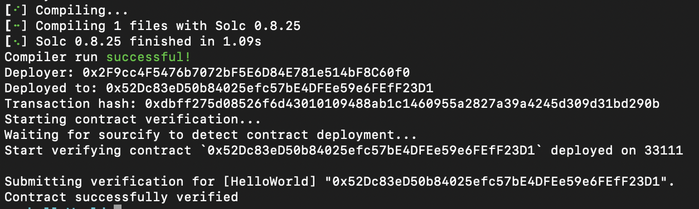

import { Callout } from 'nextra/components'

# How to Verify a Smart Contract on Apechain curtis Using Sourcify


## Introduction
Verifying a smart contract on the blockchain is crucial to ensuring transparency, security, and simplifying interaction for both users and developers. In this guide, we'll walk you through the process of verifying your smart contract on the Apechain Curtis network using Foundry and the Sourcify verifier.


## Prerequisites
Before you begin the verification process, make sure you have the following:

- **Forge Installed**: This is essential for compiling, deploying, and verifying your smart contract. You can also follow this guide to install if you haven't.

- **Ready Your Smart Contract**: Ensure your smart contract is ready to be deployed on the Curtis network. If it is already deployed then just get the contract address ready.


## Verifying Your Contract
Once your contract is deployed or ready, you can proceed with verification using Sourcify. Replace placeholders in the following commands with your actual contract details.
For contract deployment and verification:

### Mainnet

```bash copy
forge create --rpc-url https://apechain.calderachain.xyz/http --private-key YOUR-PRIVATE-KEY src/FileName.sol:ContractName --verify --verifier sourcify
```

### Testnet

```bash copy
forge create --rpc-url https://curtis.rpc.caldera.xyz/http --private-key YOUR-PRIVATE-KEY src/FileName.sol:ContractName --verify --verifier sourcify
```

This command will deploy your contract to the Apechain Testnet or Mainnet depending on the command you run and then immediately begin the verification process by submitting your contract's source code and metadata to Sourcify. Once verified, your contract's source will be publicly accessible and associated with its on-chain address.

You should see a response similar to the following after successful verification:




If your smart contract is already deployed and you just want to verify it, then all you need to do is to open your terminal and navigate to the the root directory of your deployed contract’s project run the following command below and replace YOUR-CONTRACT-ADDRESS with the actual contract address you want to verify.

### Testnet

```js {11, 22} copy
forge verify-contract Your-Contract-Address src/FileName.sol:ContractName --chain-id 33111 --verifier sourcify 
```

### Mainnet

```js copy
forge verify-contract Your-Contract-Address src/FileName.sol:ContractName --chain-id 33139 --verifier sourcify 
```

This will submit your deployed contract for verification without redeploying.


## Conclusion
Verifying your smart contract ensures transparency and boosts the credibility of your project. It also makes the contract more accessible to users and developers by associating the source code with the on-chain address. Following the steps in this guide helps create a more secure ecosystem.