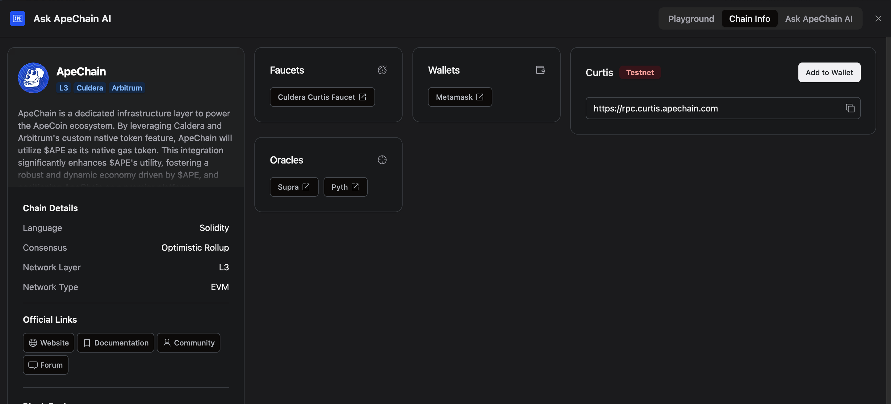

import { Callout } from 'nextra/components'

# Add ApeChain to Metamask

## Using the ApeChain Hub Page
1. Navigate to the hub for [Testnet](https://curtis.hub.caldera.xyz/) or [Mainnet](https://apechain.hub.caldera.xyz/)
2. Click the 
**Connect** button in the *Your Wallet* section, and you will be prompted to switch to the ApeChain Network

<Callout>When you click on the Connect button, please check the wallet extension icon and ensure you grant access to switch networks.</Callout>

## Connect with the ApeChain AI
You can also have the Apechain AI bot automatically add the network details to your MetaMask. Simply click on the bot, go to the "Chain Info" tab at the top right, and then click on "Add to Wallet."

## Manually add to your Metamask wallet
You can add the network with the following details:

| Mainnet     | Details|    
| :------------ | :---------: 
| Network Name | ApeChain |
| RPC URL        |   https://apechain.calderachain.xyz/http |
| Chain ID    |    33139   |   
| Currency Symbol|         APE    |
| Block Explorer| https://apechain.calderaexplorer.xyz/|
  

| Testnet      | Details|    
| :------------ | :---------: 
| Network Name | Curtis |
| RPC URL        |    https://curtis.rpc.caldera.xyz/http   |
| Chain ID    |    33111   |   
| Currency Symbol|         APE    |
| Block Explorer| https://curtis.explorer.caldera.xyz/ |

