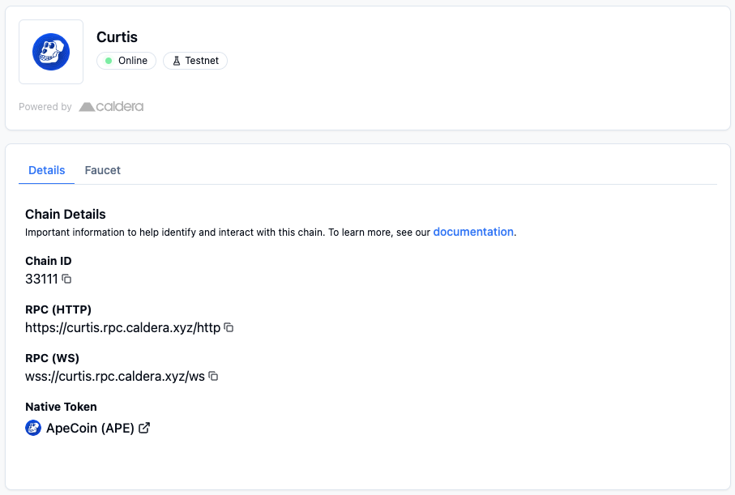

# Add [todo] Chain to Metamask
## Using the [todo] Hub Page
1. Navigate to our [Hub Page](todo: insert hub page link) 
2. Click the 
**Connect** button in the *Your Wallet* section, and you will be prompted to switch to the [todo: name] Network

## Manually via Metamask
You can add the network manually via the following details:
- Network Name: [todo]
- RPC URL: [todo]
- Chain ID: [todo]
- Currency Symbol: [todo]
