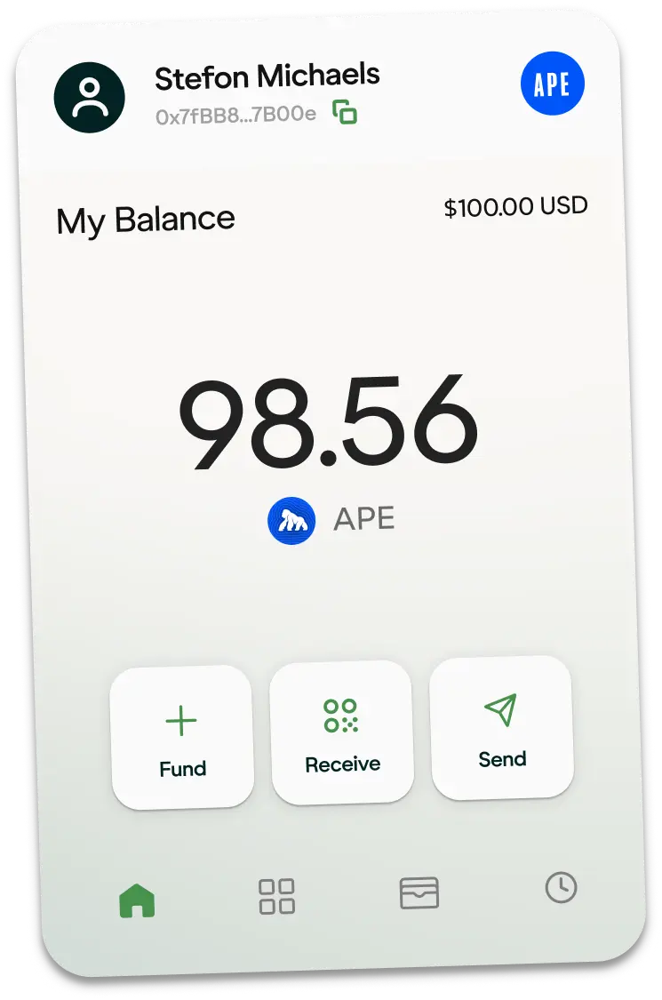
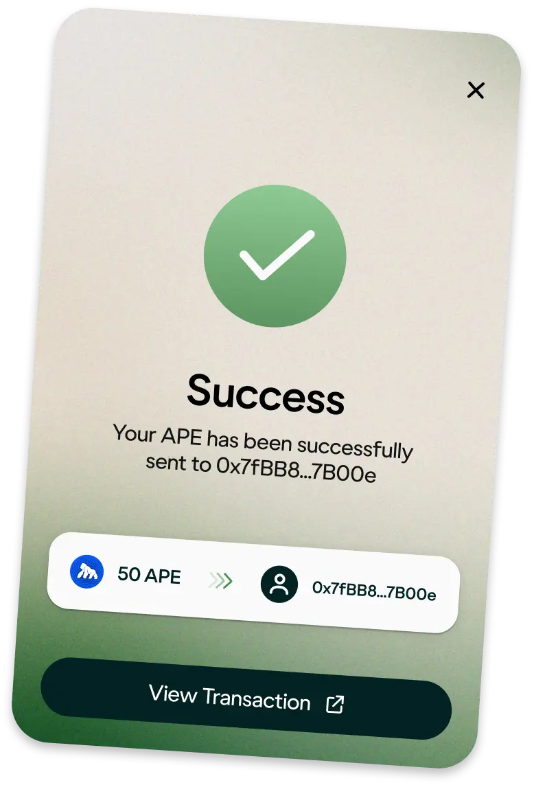

import { Callout } from 'nextra/components'

# User Onboarding

## Glyph

Glyph is designed to streamline the web3 user experience and onboarding within apps, catering two key audiences: End Users and Builders/Developers (third party apps).

At its core, Glyph functions as an onboarding solution, acting as the central hub for account management, crypto wallet integration, fiat onramping, gas sponsorship (coming soon), and onchain transactions. By utilizing external services and developing a developer-centric widget, this solution ensures we are creating a secure, efficient, and scalable product.

For everyday users, Glyph makes interactions with crypto and blockchain apps easy.

|  |  |
|:---:|:---:|

#### For Users
It enables easy onboarding, transactions, and account management without complexity.

#### For Developers
It offers a plug-and-play widget that ensures seamless integration into apps, driving adoption on ApeChain.

**Learn more at [Glyph Docs](https://docs.useglyph.io/overview/) or try out the demo: [Glyph Demo](https://demo.useglyph.io/native-integration/)**

<Callout type="warning"> React 19 or Next.js 15 is not supported yet. </Callout>

#### Using Glyph with thirdweb
Glyph is powered by Privy. That means thirdweb devs can use Glyph as the wallet provider just as they would use Privy. Here's the [walkthrough](https://solutions.thirdweb.com/products/how-to-use-thirdweb-with-privy)

## Sequence

The [Embedded Wallet](https://docs.sequence.xyz/sdk/headless-wallet/quickstart) is designed for a traditional gaming experience. The advantages are:
- Authenticate users with common social providers or email.
- Support for Unity, Unreal, Web, and Mobile.
- Optional pop-ups, modals, and transaction signing for a seamless UX.
- Fully non-custodial, smart contract wallet.
- Out of the box login with [Web SDK](https://docs.sequence.xyz/sdk/web/overview) or build your own flow.

On the other hand, the [Ecosystem Wallet](https://docs.sequence.xyz/solutions/wallets/ecosystem/overview) caters to apps who want to build an entire ecosystem and connect their users to third-party applications such as external marketplaces or DEX's.

Our [Web SDK](https://docs.sequence.xyz/sdk/web/overview) library is a customizable UI written in Typescript, tailored for a browser experience. This is great when you want to support users with existing wallets like Metamask, have an out-of-the-box experience, as well as millions of potential new users who prefer the convenience of social login.

Lastly, we provide [Wallet Linking](https://docs.sequence.xyz/sdk/web/getting-started) for your ecosystem which enables the ability for a developer to create a verifiable association between two wallets from a single user. Generally, this is a link between an embedded wallet for a game or application and an external wallet, such as Metamask so you can easily query all wallets associated with a single user - across games, ecosystems, and blockchains.

## Reown (prev. known as WalletConnect)

**[Reown](https://reown.com/?utm_source=apechain&utm_medium=docs&utm_campaign=backlinks)** gives developers the tools to build user experiences that make digital ownership effortless, intuitive, and secure.

Reown has two major product offerings, they are, **AppKit** and **WalletKit**.

### AppKit

AppKit is a powerful, free, and fully open-source SDK for developers looking to integrate wallet connections and other Web3 functionalities into their apps on any EVM and non-EVM chain. In just a few simple steps, you can provide your users with seamless wallet access, one-click authentication, social logins, and notifications—streamlining their experience while enabling advanced features like on-ramp functionality, in-app token swaps and smart accounts.

### WalletKit
WalletKit is a robust, open-source SDK designed to empower seamless wallet connections and interactions across any blockchain. With WalletKit, you can offer your users a simple and secure way to connect with thousands of apps, enabling features like one-click authentication, secure transaction signing, and streamlined wallet address verification. Its chain-agnostic design ensures effortless multi-chain support, eliminating the need for complex integrations while delivering unmatched connectivity and security.

To summarize, **AppKit** is for **Web3 applications** and **WalletKit** is for **Web3 wallets**.

You will be able to use Reown AppKit to power end-to-end wallet interactions on your Web3 app deployed on ApeChain.

Some links to learn more about Reown:
- [Website](https://reown.com/?utm_source=apechain&utm_medium=docs&utm_campaign=backlinks)
- [Blog](https://reown.com/blog?utm_source=apechain&utm_medium=docs&utm_campaign=backlinks)
- [Docs](https://docs.reown.com/?utm_source=apechain&utm_medium=docs&utm_campaign=backlinks)
- [Start building with Appkit](https://reown.com/blog/how-to-get-started-with-reown-appkit-on-apechain)