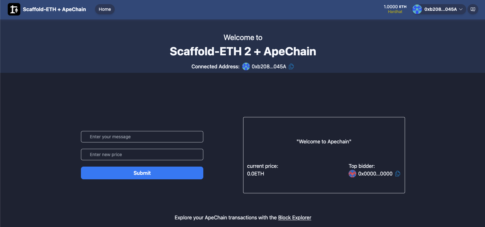

## Buidl, Quickly 

We're excited to announce that we're developing a comprehensive template for developers to leverage [Scaffold-ETH](https://scaffoldeth.io/). 

You will notice the contract example #2 within the Remix edition is added to the contract 
- packages 
    - hardhat 
        - contracts 
            - BidBoard.sol

Also, if you adjustments have been made to the harhat.config.ts file 
 ```
    apeCurtis: {
      url: `https://curtis.rpc.caldera.xyz/http/${providerApiKey}`,
      accounts: [deployerPrivateKey],
    },

    ```





Here is a [Link to the current version ](https://github.com/robbiekruszynski/scaffold-eth-2_ape)
 of the buildkit, we welcome all contributions towards  this effort to ensure devs can start developing as quickly as possible.

 ```
     yarn install 
     yarn chain 
     yarn deploy 
     yarn start 
    ```

    **Note** 
    This is meant to get you developing faster, you will need to tailor the code for your project.