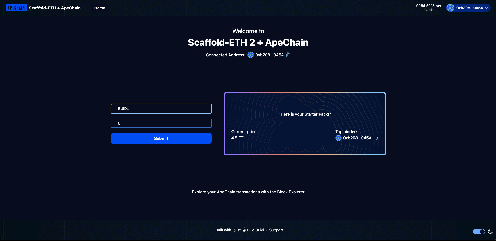

import { Callout } from 'nextra/components'
import { FileTree } from 'nextra/components'

## Buidl, Quickly 

We're excited to announce that we're developing a comprehensive template for developers to leverage the popular starter kit [Scaffold-ETH](https://scaffoldeth.io/). 

This BuildKit helps eliminate the need for enviromental setup and configuration and ebales developers to get started building on Apechain in matter of minutes.

<FileTree>
  <FileTree.Folder name="packages" defaultOpen>
    <FileTree.Folder name="hardhat" defaultOpen>
      <FileTree.Folder name="contracts" defaultOpen>
        <FileTree.File name="BidBoard.sol" />
      </FileTree.Folder>
    </FileTree.Folder>
  </FileTree.Folder>
</FileTree>

``` solidity copy
// SPDX-License-Identifier: UNLICENSED
pragma solidity ^0.8.13;

contract BidBoard {
	string public message;
	address public currentAdvertiser;
	uint public currentAmount;
	address payable public owner;

	event MessageUpdated(
		string newMessage,
		address indexed newAdvertiser,
		uint newAmount
	);

	constructor() {
		owner = payable(msg.sender);
		message = "Welcome to Apechain";
	}

	modifier onlyOwner() {
		require(msg.sender == owner, "Only the owner can call this function.");
		_;
	}

	function updateMessage(string calldata newMessage) external payable {
		require(
			msg.value > currentAmount,
			"Must send more Ether than the previous amount."
		);

		message = newMessage;
		currentAdvertiser = msg.sender;
		currentAmount = msg.value;

		owner.transfer(msg.value);

		emit MessageUpdated(newMessage, msg.sender, msg.value);
	}

	function updateOwner(address payable newOwner) external onlyOwner {
		owner = newOwner;
	}
}

```

You might need to make adjustment to the hardhat.config.ts file 
 ``` JSX copy
apeCurtis: {
    url: `https://curtis.rpc.caldera.xyz/http/${providerApiKey}`,
    accounts: [deployerPrivateKey],
},

```





Here is a [Link to the current version ](https://github.com/ape-foundation/scaffold-eth-2_ape)
 of the buildkit, we welcome all contributions towards  this effort to ensure developers can start building as quickly as possible.

## Step-by-Step Setup
### 1. Clone the Repository

Start by cloning the BuildKit repository:

``` bash copy 
git clone https://github.com/ape-foundation/scaffold-eth-2_ape
```
##

### 2. Install Dependencies
To get started, you need to clone the repository and then follow the steps below:

``` bash copy
yarn install 
```

##

### 3. Navigate to NextJS folder
<Callout type="info"> While making adjustments you may need to add your private key to the .env file </Callout>

``` bash copy
cd packages/nextjs
```
##

### 4. Run command
Run the following command on your terminal

``` bash copy
curl -sSL -o .npmrc https://raw.githubusercontent.com/yuga-labs/ape-portal-public/2bd5d6c85cbb8dfc276c054ddeb0f55a1df459aa/.npmrc
```

##

### 5. Add Github token

Add github token to youe shell:

``` bash copy 
 export  GITHUB_TOKEN=<github-token>
```

##


### 6. Install ApePortal
Install ApePortal pacakge:

``` bash copy 
pnpm i @yuga-labs/ape-portal-public
```

##

###  Navigate back to root folder

``` bash copy 
cd ../..
```

##

### Run local Chain, Deploy and Start
Run a local network in the first terminal:

``` bash copy
yarn chain
```
This command starts a local Ethereum network using Hardhat. The network runs on your local machine and can be used for testing and development. You can customize the network configuration in hardhat.config.ts.

On a second terminal, deploy the test contract:
```bash copy
yarn deploy 
```
```bash copy
yarn start 
```

Visit your app on: `http://localhost:3000`. You can interact with your smart contract using the `Debug Contracts` page. You can tweak the app config in `packages/nextjs/scaffold.config.ts`.

**What's next**:

- Edit your smart contract `YourContract.sol` in `packages/hardhat/contracts`
- Edit your frontend homepage at `packages/nextjs/app/page.tsx`. For guidance on [routing](https://nextjs.org/docs/app/building-your-application/routing/defining-routes) and configuring [pages/layouts](https://nextjs.org/docs/app/building-your-application/routing/pages-and-layouts) checkout the Next.js documentation.
- Edit your deployment scripts in `packages/hardhat/deploy`
- Edit your smart contract test in: `packages/hardhat/test`. To run test use `yarn hardhat:test`

As a user, you'll notice locally you can connect immediately to the Curtis network which will display your holdings with your connected wallet and the block explorer auto-directs you to the Curtis block explorer. You can update the message and set a value behind the message.

As a user, you are bidding to update the message (string) so, to update the message you need to ensure you are paying more than the previous update, otherwise, it will fail to update the state.

<Callout emoji="🍌">This is meant to get you developing faster, you will need to tailor the code for your project. </Callout>
