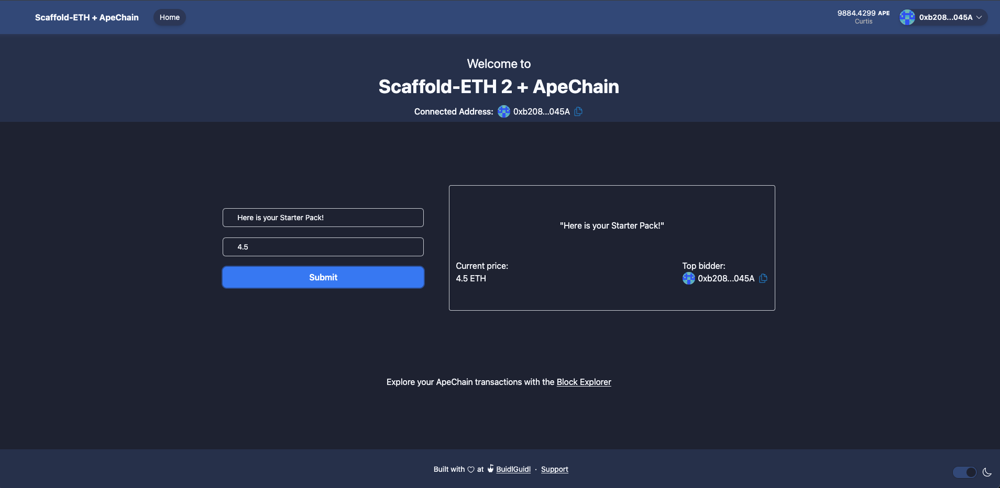

## Buidl, Quickly 

We're excited to announce that we're developing a comprehensive template for developers to leverage [Scaffold-ETH](https://scaffoldeth.io/). 

You will notice the contract example #2 within the Remix section is part of this repository.

```markdown
packages/
  ├── hardhat/
    └── contracts
       └── BidBoard.sol

```

``` solidity
// SPDX-License-Identifier: UNLICENSED
pragma solidity ^0.8.13;

contract BidBoard {
	string public message;
	address public currentAdvertiser;
	uint public currentAmount;
	address payable public owner;

	event MessageUpdated(
		string newMessage,
		address indexed newAdvertiser,
		uint newAmount
	);

	constructor() {
		owner = payable(msg.sender);
		message = "Welcome to Apechain";
	}

	modifier onlyOwner() {
		require(msg.sender == owner, "Only the owner can call this function.");
		_;
	}

	function updateMessage(string calldata newMessage) external payable {
		require(
			msg.value > currentAmount,
			"Must send more Ether than the previous amount."
		);

		message = newMessage;
		currentAdvertiser = msg.sender;
		currentAmount = msg.value;

		owner.transfer(msg.value);

		emit MessageUpdated(newMessage, msg.sender, msg.value);
	}

	function updateOwner(address payable newOwner) external onlyOwner {
		owner = newOwner;
	}
}

```


Also, adjustments have been made to the harhat.config.ts file 
 ```
    apeCurtis: {
      url: `https://curtis.rpc.caldera.xyz/http/${providerApiKey}`,
      accounts: [deployerPrivateKey],
    },

    ```





Here is a [Link to the current version ](https://github.com/robbiekruszynski/scaffold-eth-2_ape)
 of the buildkit, we welcome all contributions towards  this effort to ensure developers can start building as quickly as possible.

 ```
yarn install 

```

***Note:*** while making adjustments you may need to dd your private key to the .env file

```
yarn deploy 
```
```
yarn start 
```
As a user, you'll notice locally you can connect immediately to the Curtis network which will show your holdings with your connected wallet and the block explorer auto-directs you to the Curtis block explorer. You can update the message and set a value behind the message.

As a user, you are bidding to update the message (string) so, to update the message you need to ensure you are paying more than the previous update, otherwise, it will fail to update the state.

**Note:**
This is meant to get you developing faster, you will need to tailor the code for your project.
