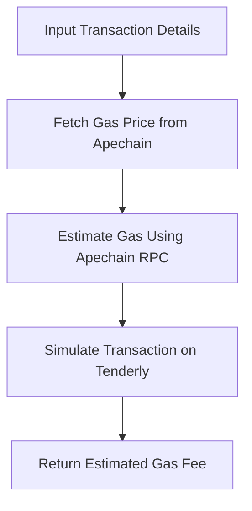

## Gas Fee Estimator 

Anyone involved in the blockchain ecosystem has likely used a gas fee estimator at some point. In this guide, we will explore how to build a gas fee estimator using Apechain and Tenderly.

### **Understanding the implementation of the gas fee estimator**

To build the gas fee estimator, we will make use of some key features of Apechain and Tenderly as listed below:

### **Apechain**

-  **RPC API for network communication**: We will use Apechain’s **RPC URL** to interact with the blockchain. This will help us with real-time interaction with the Apechain network, enabling us to retrieve accurate gas estimates and submit transactions.


### **Tenderly**

-  [**Simulation API**](https://docs.tenderly.co/reference/api#/): Tenderly simulates transactions within Apechain’s environment, offering accurate gas usage and execution insights.
- [**Transaction Simulation**](https://docs.tenderly.co/virtual-testnets/interact/simulate-transactions): Tenderly simulates the transaction in a controlled environment using the network's specific rules (in this case, Apechain). It mimics how the transaction would behave on-chain, including:
    - Gas limits
    - Contract calls
    - Execution logic

**Here’s the simple flow that we will follow to build the gas fee estimator:**

1. **Input transaction details**: The user provides necessary details for the transaction.
2. **Fetch gas price from Apechain**: Get the current gas price from the Apechain network.
3. **Estimate gas using Apechain RPC**: Use Apechain's RPC to estimate the gas required for the transaction.
4. **Simulate transaction on Tenderly**: Simulate the transaction on Tenderly to validate the transaction and predict potential failures.
5. **Return estimated gas fee**: Provide the user with the estimated gas fee for their transaction.



## Start building


1. Sign up on [Tenderly](https://tenderly.co/).
2. Get the Tenderly account slug and project slug as mentioned in the guide [here.](https://docs.tenderly.co/account/projects/account-project-slug)
3. You’ll need the following libraries to interact with Apechain, Tenderly, and handle gas estimation:
    
    ```bash copy
    npm install ethers axios dotenv
    ```
    
5. Add the Tenderly API key and Apechain URL in a `.env` file as shown below:
    
    ```makefile copy
    APECHAIN_RPC_URL=your_apechain_rpc_url_here
    TENDERLY_API_KEY=your_tenderly_api_key_here
    ```
    
6. Create a new `gasEstimator.js` file and the following code:
    
    ```jsx
    require('dotenv').config();
    const { ethers } = require('ethers');
    const axios = require('axios');
    
    // Apechain RPC URL and Tenderly API key from .env
    const APECHAIN_RPC_URL = process.env.APECHAIN_RPC_URL;
    const TENDERLY_API_KEY = process.env.TENDERLY_API_KEY;
    
    // Set up Apechain provider
    const provider = new ethers.JsonRpcProvider(APECHAIN_RPC_URL);
    
    // Function to estimate gas
    async function estimateGas(transaction) {
      try {
        const gasEstimate = await provider.estimateGas(transaction);
        console.log(`Estimated Gas: ${gasEstimate.toString()}`);
        return gasEstimate;
      } catch (error) {
        console.error('Error estimating gas:', error);
      }
    }
    
    // Function to simulate transaction on Tenderly
    async function simulateTransaction(transaction) {
      try {
        const response = await axios.post(
          `https://api.tenderly.co/api/v1/account/ethereum/simulate`,
          {
            transaction,
          },
          {
            headers: {
              'Authorization': `Bearer ${TENDERLY_API_KEY}`,
            },
          }
        );
    
        console.log('Simulation Result:', response.data);
        return response.data;
      } catch (error) {
        console.error('Error simulating transaction on Tenderly:', error);
      }
    }
    
    // Example usage: Estimate gas and simulate transaction
    async function main() {
      const transaction = {
        to: '0xRecipientAddressHere',
        value: ethers.utils.parseEther('0.1'), // 0.1 ETH
        data: '0x', // Optional: Contract call data
      };
    
      const gasEstimate = await estimateGas(transaction);
      await simulateTransaction(transaction);
    }
    
    main();
    ```
    
7. Run the script to estimate gas and stimulate a transaction:
    
    ```bash
    node gasEstimator.js
    ```