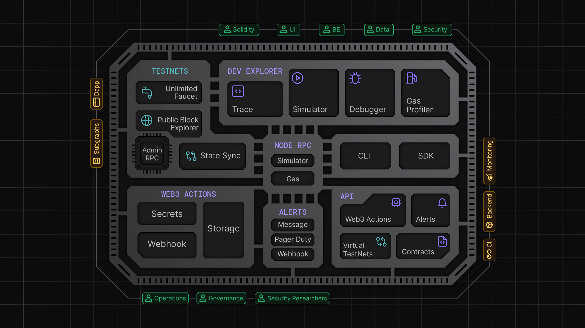
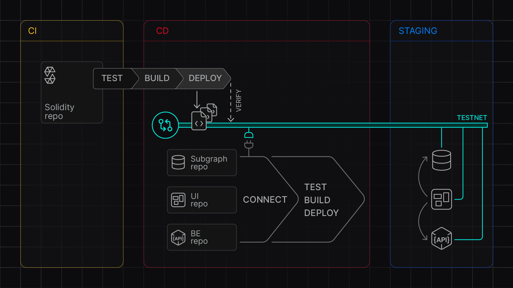
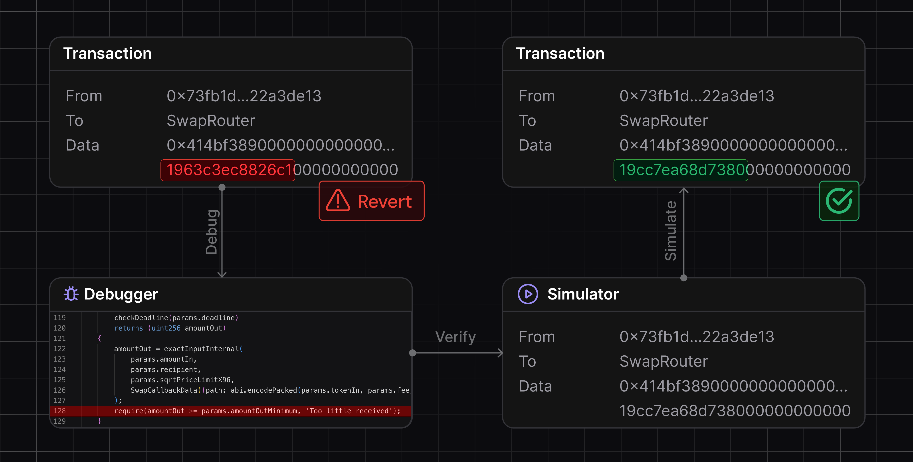
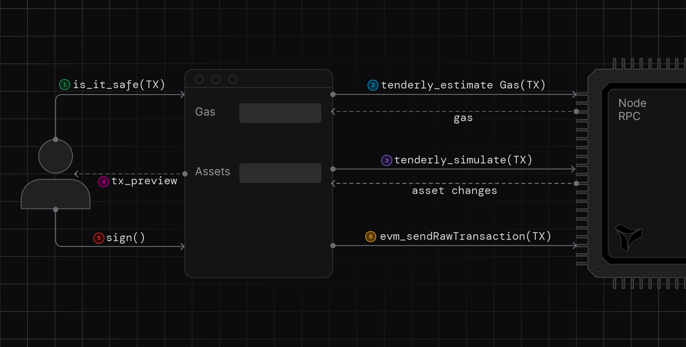
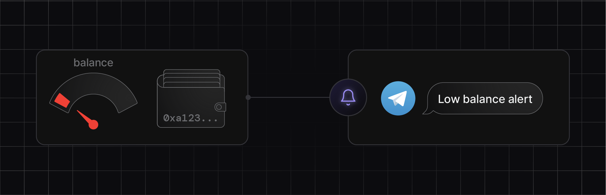
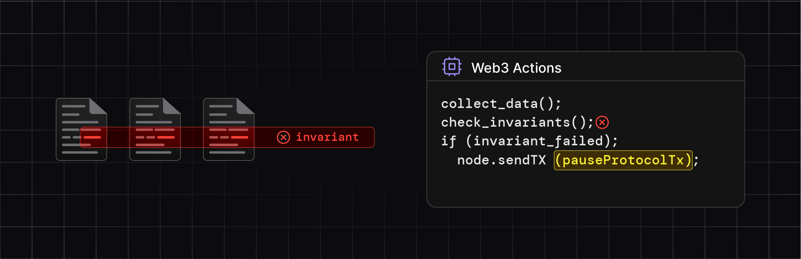
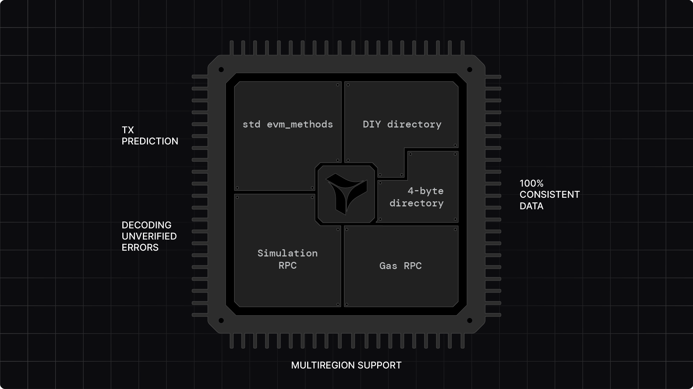

# Tenderly

## Tenderly: Full Stack Web3 Infrastructure
Tenderly enhances development experience on ApeChain by providing seamless integration with ApeChain ecosystem. It offers a high-performance Node RPC with integrated mainnet-like development environments, intuitive developer tools, and real-time monitoring.

By integrating Tenderly’s full-stack infrastructure, you can **optimize your development workflows** and **scale your dapp** on a high-performance infrastructure.

In this document, you will find:

- How to get started
- Tenderly's [key features](#tenderly-platform-overview) and ideas how to use them
- How you can [integrate in your workflow](#Integration-with-your-workflow)
- Several [real world examples](#real-world-examples)

## Get Started

1. [Create an account](https://dashboard.tenderly.co/register)
2. [Create a virtual TestNet on ApeChain](https://docs.tenderly.co/virtual-testnets/quickstart)
3. [Use unlimited faucet](https://tenderly-docs-nextra-test-git-external-docs-tenderly.vercel.app/virtual-testnets/unlimited-faucet)
4. Learn more on [**official docs**](https://docs.tenderly.co)

## How to use Tenderly

Web3 teams can use Tenderly’s infrastructure and tools to build and scale secure and high-quality Web3 software faster and more efficiently.

Here are some of the ways you can use Tenderly:

- **Test and stage contracts and dapps**: Use Virtual TestNets in CI/CD pipelines to deploy, test, and stage smart contracts in mainnet-like development environments, eliminating the need for local setups or unreliable public testnets.
- **Optimize smart contracts**: Debug and optimize transaction inputs using Simulator and Debugger, reducing debugging time from hours to minutes with visual transaction trace inspection.
- **Predict transaction outcomes**: Integrate Simulation RPC to simulate transaction execution and gas costs, preventing errors and optimizing token transfers before submitting transactions on-chain.
- **Automate security responses**: Implement automated responses to on-chain events and protocol issues using real-time Alerts and Web3 Actions to safeguard your dapps and protocols.
- **Ensure high-performance dapp connectivity**: Use Node RPC to guarantee low-latency, high-reliability, and multi-region access for your dapp, ensuring smooth operation even during high traffic volumes and spikes.

### Tenderly Platform Overview

 

### 1. Virtual TestNets

Accelerate your development cycle with instant, collaborative development environments that seamlessly integrate into your existing workflows, saving you hours of setup and configuration time.

**Using Virtual TestNets**:

Test and stage contracts and dapps using RPC development infrastructure that fully replicates mainnet conditions.

- **Deploy and verify smart contracts** on dedicated development infrastructure for your whole team.
- **Stage and test your dapp** smart contracts, frontend, and backend in isolated, yet collaborative cloud-managed environments.
- **Set up CI/CD pipelines** free of running dedicated nodes and additional infrastructure management.
- **Use unlimited faucet** to Test contract and transaction execution more easily.
- **Debug and optimize smart contracts** using a built-in virtual explorer and debugging tools.
- **Access latest mainnet state while testing** in real time using State Sync.
- **Customize network states** to meet your unique testing requirements via `tenderly_` cheat-code RPCs.
- **Stage DAO proposals** and test protocol behavior as if the proposed change is applied.

**Try it now**: [Create your first Virtual TestNet](https://docs.tenderly.co/virtual-testnets/quickstart)

### 2. Simulator UI & Debugger

Slash debugging time from hours to minutes with an intuitive visual interface that lets you step through transactions, decode state changes, and optimize your smart contracts effortlessly for any contract on any network, with no additional setup.

**Using Simulator and Debugger**:

Build proof-of-concept transactions and troubleshoot smart contracts without lengthy `console.log` debugging.

 

- **Understand transaction execution** with decoded arguments, events, and state changes.
- **Debug any transaction** on public networks and Virtual TestNets with the most detailed stack trace.
- **Edit source code in your browser** and simulate the execution to verify bug fixes.
- **Optimize transaction inputs** using the latest or historical mainnet data.
- **Build proof-of-concept transactions** for security research or optimization purposes.

**Try it now**: [Debug a transaction](https://docs.tenderly.co/simulator-ui/using-simulation-ui)

### 3. Simulation and gas estimation RPC

Accurately predict transaction outcomes and gas costs without sending transactions on-chain to improve your dapp UX and prevent costly errors. Integrate Tenderly’s simulation infrastructure using `tenderly_simulateTransaction`, `tenderly_estimateGas`, and their bundled counterparts.

**Using Simulation RPC**:

Predict transaction execution under any network and contract states.

- **Predict token transfers** in transactions reliably for secure and cost-effective interactions in your dapp
- **Optimize bundles of transactions** by predicting execution and picking optimal results.
- **Optimize for best token transfers** by varying transaction inputs and other strategies in a different simulations.
- **Test hypothetical scenarios** by overriding contract variables and running custom simulations
- **Test and compare different strategies** by running simulations on historic network data.
- **Get 100% accurate gas estimates** to prevent failures caused by out-of-gas errors and save valuable resources.

**Try it now**: [Simulate a transaction](https://docs.tenderly.co/simulations/quickstart)

### 4. Alerts & Web3 Actions

Automate protocol security and maintenance and respond instantly to on-chain events with customizable, real-time alerting and serverless Node.js backends for smart contracts.

**Using Alerts and Web3 Actions:**

Implement circuit breakers, monitor live contracts, and automate task execution.

- **Get real-time messages** for important on-chain events with Alerts.
- **Monitor the usage** of your smart contracts and dapp on-chain with Alerts.
- **Signal problems to external webhooks** by setting up alerts on transactions, events, and storage updates.
- **Automate responses to on-chain events** using Web3 Actions.
- **Set up invariant monitoring** for protocols, dapps, and entire architectures with Web3 Actions.
- **Build Tenderly-hosted webhooks** for dapps with Web3 Actions.

**Try it now**: [Set up your first alert](https://docs.tenderly.co/alerts/tutorials-and-quickstarts/alerting-quickstart-guide) | [Set up your first Web3 Action](https://docs.tenderly.co/web3-actions/tutorials-and-quickstarts/how-to-send-a-discord-message-about-a-new-uniswap-pool)

### 5. Node RPC

Ensure your dapp's performance with enterprise-grade RPC access that scales unnoticeably, ensuring low-latency and high-availability across multiple regions.

**Using Node RPC**:

Integrate Tenderly Node RPC for low-latency, high-reliability, multi-region blockchain infrastructure that scales with your dapp usage.

- **Rely on 100% consistent data** and uninterrupted access even with spiking usage.
- **Use `tenderly_` RPC methods** for simulations, 100% accurate gas estimation, tracing, and more directly from your dapps.
- **Build custom RPC methods** that encapsulate unique dapp logic via Node Extensions.
- **Request multi-region support** and region-specific setup.

**Try it Now**: [Get started with Node RPC](https://docs.tenderly.co/node/integrations)

## Integration with your workflow

Integrate Tenderly at any development or production stage to build and scale fast, secure, and reliable dapps and protocols.

### Development

Efficiently build and test smart contracts with tools that integrate seamlessly and improve your team's development workflows.

- [**Hardhat & Foundry**](https://docs.tenderly.co/contract-verification): Seamless integration for contract verification in private or public mode.
- [**CI/CD pipelines**](https://docs.tenderly.co/virtual-testnets/develop/stage-contracts): Incorporate Virtual TestNets and deploy contracts and off-chain components within your CI/CD pipelines for efficient development and testing.
- [**Unlimited Faucet**](https://docs.tenderly.co/virtual-testnets/unlimited-faucet): Enable backend, UI, and data engineers to easily access high volumes of native and ERC-20 tokens.
- [**Viem/Ethers/Web3.js/Web3.py**](https://docs.tenderly.co/virtual-testnets/integrations#client-libraries): Use your favorite client library for chain interactions.
- [**React UI Libraries**](https://docs.tenderly.co/virtual-testnets/integrations#dapp-ui-libraries): Connect React UI libraries and wallet providers seamlessly.
- [**SDK**](https://docs.tenderly.co/tenderly-sdk/intro-to-tenderly-sdk) & [**CLI**](https://docs.tenderly.co/cli): Login and integrate Tenderly features directly into your development workflow.

### Transaction execution prediction

Provide users with accurate predictions and insights to enhance user experience, prevent costly mistakes, and avoid potential security risks.

- [**Simulation RPC**](http://docs.tenderly.co/simulations/single-simulations#simulate-via-rpc): Integrate Simulation RPC to inform users about transaction outcomes before they sign and send them to the chain.
- [**Token transfers**](http://docs.tenderly.co/simulations/asset-balance-changes): Use simulation predictions with varying inputs and other strategies to optimize token transfers.
- [**Gas Estimations**](http://docs.tenderly.co/simulations/gas-estimation): Get 100% correct gas estimations for optimizing gas spending.
- [**Bundle Simulations**](http://docs.tenderly.co/simulations/bundled-simulations) and [**Bundle Gas Predictions**](http://docs.tenderly.co/node/rpc-reference/ethereum-mainnet/tenderly_estimateGasBundle): Predict the execution of interconnected, bundled simulations for further optimizations.

### Staging

Create a reliable staging environment that mirrors mainnet conditions for thorough testing and collaborative development.

- [**Virtual TestNet API**](https://docs.tenderly.co/reference/api#/operations/createVnet): Use the API to create and manage Virtual TestNets within your Continuous Integration setup.
- [**Github Actions**](https://docs.tenderly.co/virtual-testnets/quickstart#ci-cd-integration): Integrate with Github Actions workflows to use Virtual TestNets as contract deployment and staging infrastructure.
- [**Public Block Explorer**](https://docs.tenderly.co/virtual-testnets/testnet-explorer): Expose public explorer to testers while controlling the visibility of your contracts' interfaces and source code.
- [**Assets for testing**](https://docs.tenderly.co/virtual-testnets/unlimited-faucet): Provide any amount of assets for testing using an unlimited faucet for native and ERC-20 tokens, available via RPC methods on Virtual TestNets.

### Protocol upgrading

Bullet-proof upgrades by testing post-update behavior before deployment, whether it's a proxy upgrade, multisig transaction execution, or any other form of protocol upgrade.

- [**Multisig transactions**](https://docs.tenderly.co/virtual-testnets/protocol-upgrades): Dissect multisig transactions on a Virtual TestNet, by approving and executing queued transactions.
- [**DAO proposals**](https://docs.tenderly.co/virtual-testnets/dao-proposals): Validate DAO proposals in a realistic environment by staging on an isolated Virtual TestNet synced with mainnet data.
- [**Protocol updates**](https://docs.tenderly.co/virtual-testnets/protocol-upgrades): Validate protocol updates by staging them on a Virtual TestNet, using Simulator UI and Debugger to execute and analyze transactions in a safe environment.
- [**Proxy upgrades**](https://docs.tenderly.co/virtual-testnets/proxy-upgrades): Perform security checks of proxy contract upgrades using Virtual TestNets, Simulator UI, and Debugger.

### Monitoring & security operations

Monitor on-chain activities and respond to security threats in real time to safeguard your dapps and protocols.

- [**Wallets**](https://docs.tenderly.co/alerts/wallet-monitoring): Monitor a set of wallets to get alerts when funds are getting low or unexpected transfers are taking place.
- [**Contract access**](https://docs.tenderly.co/alerts/contract-access-monitoring): Monitor who accesses your contracts and functions to avoid tampering.
- [**Protocol state changes**](https://docs.tenderly.co/alerts/protocol-state-changes): Monitor the changes of specific storage slots or view function values.
- [**Invariant monitoring**](https://docs.tenderly.co/alerts/invariant-monitoring): Build runtime invariant checkers for your complete architecture.
- [**Pausing protocols**](https://docs.tenderly.co/web3-actions/pausing-protocols): Pause protocols when you detect suspicious activity using monitoring rules you set in place.

### Chain operations

Optimize your blockchain interactions and maintain smooth operations with reliable infrastructure and automated tasks.

- [**Multi-region RPC access**](https://docs.tenderly.co/node): Ensure low-latency access from any location using Node RPC.
- [**Periodic tasks**](https://docs.tenderly.co/web3-actions/references/action-functions-events-and-triggers#periodic-event): Build CRON-based Web3 Actions for maintenance tasks.
- [**Custom RPC methods**](https://docs.tenderly.co/node/node-extensions): Extend standard RPC functionality with custom methods to suit specific operational needs and enhance dapp performance.
- [**Reliable usage monitoring**](https://docs.tenderly.co/node): Continuously monitor the usage and performance of your Node RPC.

## Real-world examples

Discover how some of the leading projects use Tenderly to streamline their development, enhance security, and improve user experience.

- [Maker DAO](https://makerdao.com/) performs [cross-dao testing between different teams](https://blog.tenderly.co/case-studies/makerdao/).
- [Maple Finance](https://maple.finance/) created [invariant monitoring](https://maplefinance.gitbook.io/maple/technical-resources/security/security#critical-monitoring).
- [Spark Protocol](https://spark.fi/) has set up invariant monitoring and [testing](https://devs.spark.fi/sparklend/features/testing-guide).
- [Yearn Finance](https://yearn.fi/) relies on Tenderly for [incident management](https://blog.tenderly.co/case-studies/what-good-war-room-emergency-procedure-yearn-finance-case/).
- [Uniswap](https://app.uniswap.org/) uses Tenderly for development, [incident responses](https://blog.tenderly.co/case-studies/uniswap/), getting [100% correct gas](https://blog.tenderly.co/how-tenderly-enables-most-accurate-ethereum-gas-estimation/) estimates, and [governance seatbelt](https://github.com/Uniswap/governance-seatbelt).
- Safe [integrates Tenderly’s simulation infrastructure](https://blog.tenderly.co/case-studies/safe/) in their multisig interface.