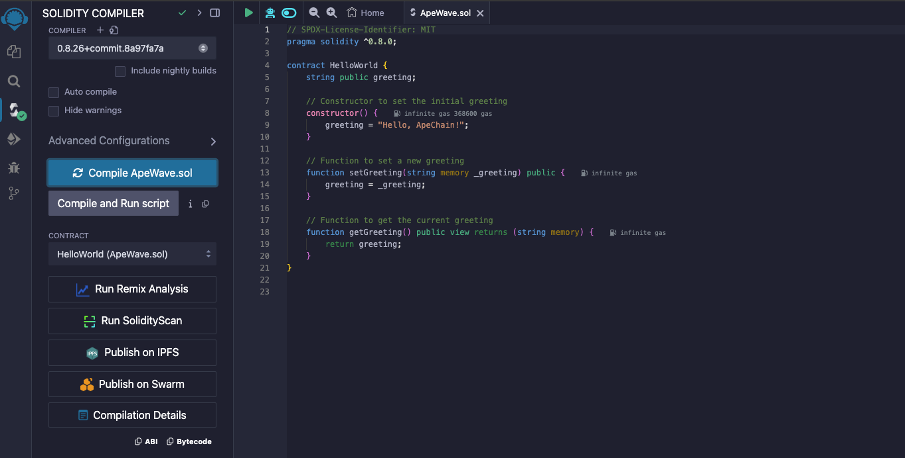
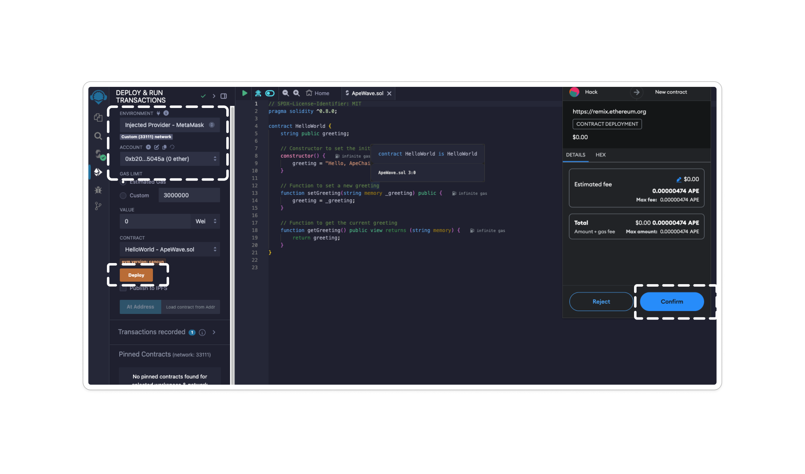

# Remix
## What is Remix? 
Remix Project is a robust set of tools that can be used by individuals of any skill level throughout the entire process of developing contracts, and it also serves as an educational platform for learning and experimenting with Ethereum.

## Getting Started with Remix ( Contract example #1 )
1. Visit Remix to get started. 
1. Under **Featured Plugins**, select **Solidity**.
3. Navigate to the **File Explorer** and click "**+**" to create a Smart Contract 
4. Input your smart contract or use the sample contract below.
```solidity

// SPDX-License-Identifier: MIT
pragma solidity ^0.8.0;

contract HelloWorld {
    string public greeting;

    // Constructor to set the initial greeting
    constructor() {
        greeting = "Hello, ApeChain!";
    }

    // Function to set a new greeting
    function setGreeting(string memory _greeting) public {
        greeting = _greeting;
    }

    // Function to get the current greeting
    function getGreeting() public view returns (string memory) {
        return greeting;
    }
}
```
5. Navigate to the **Compile** sidebar option and click Compile. 



<br></br>

After you compile your contract and you obtain test $Ape from our hub you can then select 

*Enviroment* on the left had side (see below) and switch to the Curtis Network where you can deploy / interact with your contract, this time on our testnet oppposed to the VM.





After you compile you have the ability to interact with the contract on the left side 

You also have the ability to view the deployment of your contract on the Curtis Block Explorer (Found here https://curtis.explorer.caldera.xyz/)


## Getting Started with Remix ( Contract example #2 ) 
```solidity

// SPDX-License-Identifier: MIT

pragma solidity ^0.8.13;


contract BidBoard {
    string public message;
    address public currentAdvertiser;
    uint public currentAmount;
    address payable public owner;
    
    event MessageUpdated(string newMessage, address indexed newAdvertiser, uint newAmount);
    
    constructor() {
        owner = payable(msg.sender);
    }
    
    modifier onlyOwner() {
        require(msg.sender == owner, "Only the owner can call this function.");
        _; 
    }
    
    function updateMessage(string calldata newMessage) external payable {
        require(
            msg.value > currentAmount,
            "Must send more Ether than the previous amount."
        );
        
        message = newMessage;
        currentAdvertiser = msg.sender;
        currentAmount = msg.value;
        
        owner.transfer(msg.value);
        
        emit MessageUpdated(newMessage, msg.sender, msg.value);
    }
    
    function updateOwner(address payable newOwner) external onlyOwner {
        owner = newOwner;
    }
}
```

In this contract after deployment you have the ability to call on the following 
```
updateMessage
updateOwnercurrent 
currentAdvertiser
currentAmount
message
owner
```
Interacting with the Contract

After deploying, you’ll see your contract instance appear under "Deployed Contracts."
You can now interact with the updateMessage function.


**Interact with the contract**

1. To send ETH with the updateMessage function:
In the *"Value"* input box above the function list, enter the amount of test ETH you want to send. For example, 2 for 2 ETH.
In the "updateMessage" function:

Enter a new message in the newMessage input box.
Click the "transact" button to send the transaction.
This will update the contract’s message and transfer the ETH you specified to the contract's owner.

Example:
If you enter "Hello, Ape" in the newMessage box and 1 in the Value box, and then click "transact," 2.5 ETH will be sent with the transaction. If this amount is greater than the current highest amount, the contract’s message and advertiser will be updated, and the ETH will be transferred to the owner's address.

2. Check the Results

After the transaction is mined, you can check:
The message variable to see the updated message.
The currentAdvertiser to see the address that sent the ETH.
The currentAmount to see the amount of ETH associated with the current message.


